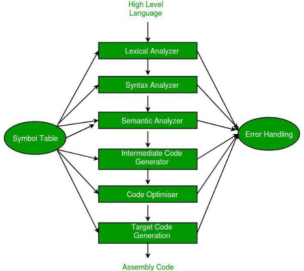

Compiler Design 

A compiler translates the code written in one language to some other language without changing the meaning of the program. It is also expected that a compiler should make the target code efficient and optimized in terms of time and space. 

Compiler design principles provide an in-depth view of translation and optimization process. Compiler design covers basic translation mechanism and error detection & recovery. It includes lexical, syntax, and semantic analysis as front end, and code generation and optimization as back-end. 

The **compiler** is  software  that  converts  a  program  written  in  a  high-level language (Source Language) to a low-level language (Object/Target/Machine Language/0’s, 1’s).  

- **Cross Compiler** that runs on a machine ‘A’ and produces a code for another machine ‘B’. It is capable of creating code for a platform other than the one on which the compiler is running. 
- **Source-to-source  Compiler** or  transcompiler  or  transpiler  is  a compiler that translates source code written in one programming language into the source code of another programming language. 

**Language processing systems (using Compiler):** We know a computer is a  logical  assembly  of  Software  and  Hardware.  The  hardware  knows  a language, that is hard for us to grasp, consequently, we tend to write programs in a high-level language, that is much less complicated for us to comprehend and  maintain  in  thoughts.  Now,  these  programs  go  through  a  series  of transformations so that they can readily be used by machines. This is where language procedure systems come in handy.  

A translator or language processor is a program that translates an input program written in a programming language into an equivalent program in another language. The compiler is a type of translator, which takes a program written in a high-level programming language as input and translates it into an equivalent program in low-level languages such as machine language or assembly language. The program written in a high- level language is known as a source program, and the program converted into low-level language is known as an object (or target) program. Moreover, the compiler traces the errors in the source program and generates the error report. Without compilation, no program written in a high-level language can be executed. After compilation, only the program in machine language is loaded into the memory for execution. For every programming language, we have a different compiler; however, the basic tasks performed by every compiler are the same. 

- **High-Level Language:** If a program contains #define or #include directives such as #include or #define it is called HLL. They are closer to humans but far from machines. These (#) tags are called preprocessor directives. They direct the pre-processor about what to do. 
- **Pre-Processor:** The pre-processor removes all the #include directives by including the files called file inclusion and all the #define directives using macro expansion. It performs file inclusion, augmentation, macro-processing, etc. 
- **Assembly Language:** It’s neither in binary form nor high level. It is an intermediate state that is a combination of machine instructions and some other useful data needed for execution. 
- **Assembler:** For every platform (Hardware + OS) we will have an assembler. They are not universal since for each platform we have one. The output of the assembler is called an object file. Its translates assembly language to machine code. 
- **Interpreter:** An interpreter converts high-level language into low- level machine language, just like a compiler. But they are different in the way they read the input. The Compiler in one go reads the inputs, does the processing, and executes the source code whereas the interpreter does the same line by line. A compiler scans the entire program and translates it as a whole into machine code whereas an interpreter translates the program one statement at a time. Interpreted programs are usually slower with respect to compiled ones. 
- **Relocatable Machine Code:** It can be loaded at any point and can be run. The address within the program will be in such a way that it will cooperate with the program movement. 
- **Loader/Linker:** It converts the relocatable code into absolute code and tries to run the program resulting in a running program or an error message (or sometimes both can happen). Linker loads a variety of object files into a single file to make it executable. Then loader loads it in memory and executes it. 

**Phases of a Compiler:** 

There are two major phases of compilation, which in turn have many parts. Each of them takes input from the output of the previous level and works in a coordinated way.  

**Analysis Phase:** An intermediate representation is created from the given source code :  

1. Lexical Analyzer 
1. Syntax Analyzer 
1. Semantic Analyzer 
1. Intermediate Code Generator 

Lexical analyzer divides the program into “tokens”, the Syntax analyzer recognizes “sentences” in the program using the syntax of the language and the Semantic analyzer checks the static semantics of each construct. Intermediate Code Generator generates “abstract” code.  

**Synthesis Phase:** Equivalent target program is created from the intermediate representation. It has two parts :  

1. Code Optimizer 
1. Code Generator 

Code Optimizer optimizes the abstract code, and the final Code Generator translates abstract intermediate code into specific machine instructions.  
